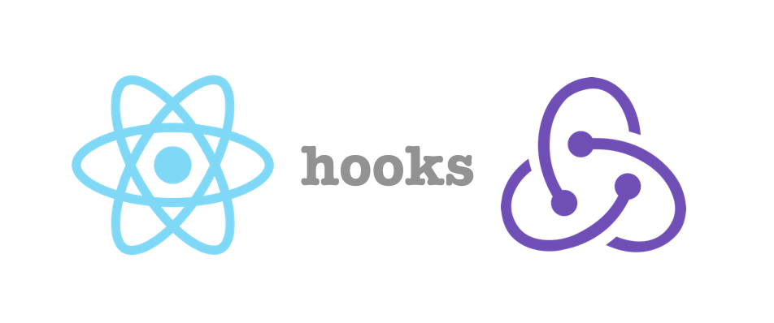

<h1 align="center">👋 Hi there, I'm  Roman</h1>

  <a href="https://www.linkedin.com/in/roman-didukh/">Linkedin</a> •
  <a href="https://t.me/romadidukh">Telegram</a> •
  <a href="mailto:didukhroma@gmail.com">Email</a>

- 🌱 I’m currently learning **TS**
- ⚡ Fun fact: **I love  learn coding**

### My stack and tools

<!--  -->

<!--  -->

<!--  -->

<!--  -->

